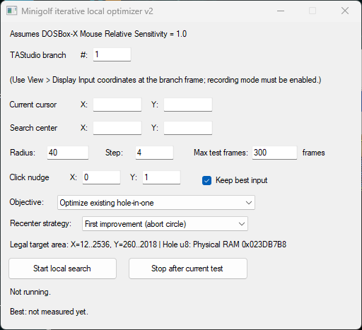

# Iterative local shot optimizer

A TAStudio Lua script for locally optimizing shots in **Minigolf am PC** running under DOSBox-X in [Chimera](https://github.com/ToolAssisted-run/chimera/releases) or [BizHawk](https://github.com/TASEmulators/BizHawk/releases). It repeatedly tests nearby mouse target coordinates and measures how many frames each shot takes to enter the hole, in an attempt to find the quickest hole-in-one. This is a **local** iterative search so a result may be a local optimum rather than the globally fastest shot. To evaluate and compare solutions, the script detects hole completion from the `0x023DB7B8` (Physical RAM domain), the value of which is the current course number (minus one) and which changes on the frame the ball enters the hole.

For a more detailed explanation of the input model and the development of both optimizers, see the corresponding toolassisted.run forum post [here](https://forum.toolassisted.run/t/minigolf-am-pc-pc-minigolf-am-pc/1540/2)

# TO DO: LINK

## Requirements

- Mouse Relative Sensitivity = 1.0

## Usage

Create a TAStudio branch on the first frame of the shot, enable recording mode, and run this Lua script via Tools > Lua Console. Enter the branch number into the "TAStudio Branch" field. Next, obtain the current coordinates of the guest mouse via View > Display Input (for the input to appear, Recording Mode has to be active in TAStudio). Then configure the search in the script window and click "Start local search". Aside from the cursor coordinates, the following variables can be set:

### Radius and Step

Radius controls the size of the circle, i.e., the search neighborhood around the chosen initial coordinate. Step controls the spacing between tested coordinates: a smaller step gives a denser search but requires more tests; from my testing I found a step-size of 4 to be the biggest possible value without skipping any shots.

### Max test frames

The maximum time initially allowed for a candidate to complete the hole. Mainly relevant for the "Find a hole-in-one" mode where candidates may run for up to this many frames until either a solution is found (or the script moves on to the next coordinate).

### Click nudge

Adds a small movement on the button-down frame which is necessary for the shot to actually register in this game

### Keep best input

When checked, the best shot found is written back into TAStudio when the search finishes.

### Objective

The script offers two search modes:

- *Optimize existing hole-in-one*: Start from a known solution and search nearby coordinates for a faster one
- *Find a hole-in-one*: search around a chosen coordinate even if the current shot is a miss or part of a multi-shot solution

### Recenter strategies

- *First improvement (abort circle)*: As soon as a faster solution is found, the rest of the current search circle is skipped and the optimizer immediately recenters on that new fastest result.
- *Best improvement (finish circle)*: The optimizer finishes the entire current circle and then recenters on the fastest improvement found there. This requires more work per iteration but bases each recentering decision on the complete current neighborhood. Already-tested coordinates are cached and skipped when later neighborhoods overlap.
